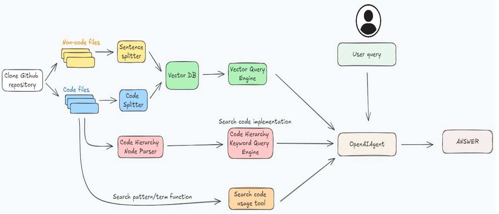

# Repo-Chatbot: Chat With Your Github Repository

## 🤖 Background

Developers often face challenges when working with new codebases, spending significant time on code comprehension. Research indicates that developers dedicate approximately **58%** of their work time to understanding programs, particularly in open-source environments where libraries are frequently utilized [1].

Given those constraints, in this project, I have developed a chatbot utilizing RAG and multi-agent to understand the whole given codebase. This chatbot is developed as a tool for developers to efficiently comprehend the codebase and spend more time on doing their jobs.

## ⚙️ Workflow

### 1. Chunking

As code and non-code files (documentation…) has every different architecture, separate splitter is required for each file type. 

- **Non-code files: `SentenceSplitter`** to chunk the documents
- **Code files:**
    - `CodeSplitter`: utilize AST to split code [2].
    - **`CodeHierarchyNodeParser`**: create a tree for each code file with each node is defined based on the scope such as functions, classes, methods,… [3]
        
        
        

### 2. Tools

- **Vector Query Engine:** useful to answer questions related to information of the codebase provided in the documentation files.
    - Example questions:
        - "Hi, can you tell what is ultralytics?"
        - "Can you summarize the README file?"
        - "What are the installation instructions provided in the README?"

- **Code Query Engine** (`create_code_hierarchy_engine()`): useful to find the implementation of a function or class in the codebase and understand the structure of the codebase.
    - Example questions:
        - "What files are in the `src/` directory?"
        - "Show me the implementation of the `main()` function."
        - "What classes are defined in `common.py`?"
        - "What are the imports in `utils.py`?"

- **Search Code Engine** (`code_search.py`):  useful for searching a term or pattern in all files within a directory, such as to find where the function is used within the repository.
    - Example questions:
        - "Where is the `config` variable used in this repository?"
        - "Which files import the `utils` module?"
        - "Which functions call the `process_data()` function?"

### 3. Agent

Using `OpenAIAgent` to call OpenAI to decide which tool to call and with what arguments.

## Reference

[1] X. Xia, L. Bao, D. Lo, Z. Xing, A. E. Hassan and S. Li, "Measuring Program Comprehension: A Large-Scale Field Study with Professionals," in IEEE Transactions on Software Engineering, vol. 44, no. 10, pp. 951-976, 1 Oct. 2018, doi: 10.1109/TSE.2017.2734091

[2] [https://docs.llamaindex.ai/en/stable/api_reference/node_parsers/code/](https://docs.llamaindex.ai/en/stable/api_reference/node_parsers/code/)

[3] [https://docs.llamaindex.ai/en/v0.9.48/api/llama_index.node_parser.HierarchicalNodeParser.html](https://docs.llamaindex.ai/en/v0.9.48/api/llama_index.node_parser.HierarchicalNodeParser.html)
